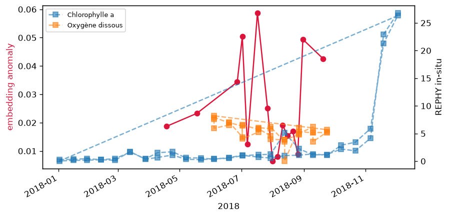
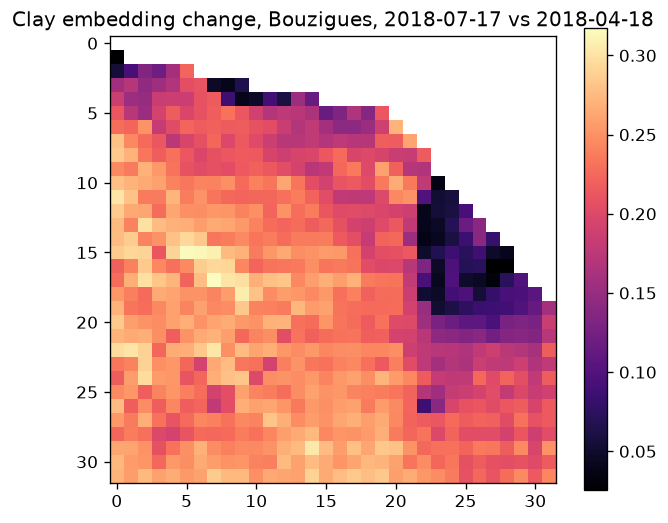
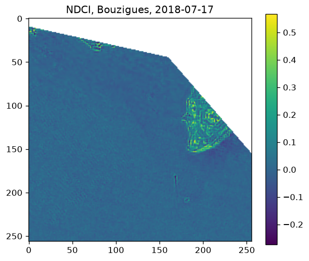
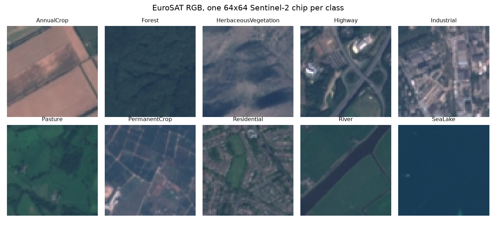
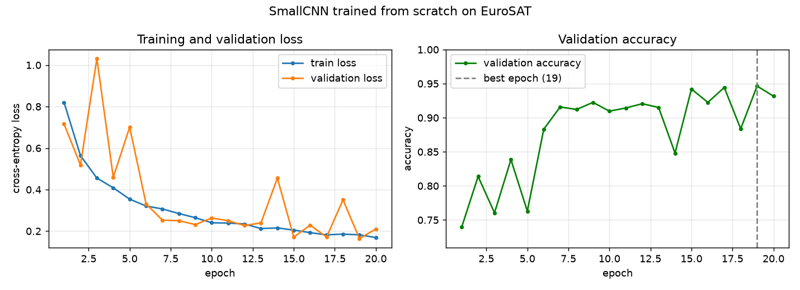

# malaigue-from-space

[](https://github.com/sami-ennedoui/malaigue-from-space/actions/workflows/ci.yml)

Can a geospatial foundation model recognise a water-quality crisis it was never trained on? This
repository tests Clay v1.5 against the 2018 malaïgue in the étang de Thau, a severe summer anoxia
that killed most of the lagoon's shellfish. Clay runs on Sentinel-2 imagery as a frozen encoder,
and its embeddings are measured against the IFREMER in-situ record and a chlorophyll index.

They do not detect it. Over fifteen cloud-free scenes from April to September 2018 the lagoon
embedding moves by at most 0.059 in cosine distance, shows no correlation with in-situ oxygen or
chlorophyll, and has no spatial overlap with the chlorophyll index. The measurement that marks the
crisis is the in-situ dissolved oxygen, which fell to 0.04 mg/L at Bouzigues on 13 August. The
full report, with methods and figures, is in [docs/evaluation.md](docs/evaluation.md).

That is the main result. A second, self-contained experiment then asks whether this imagery is
learnable at all once labels exist: it trains a small CNN from scratch on the EuroSAT land-use
dataset, which reaches about 94.8 percent. Both experiments are written up below, with figures.

## The malaïgue result

| Reference | Metric | Value |
| --- | --- | --- |
| Embedding against the spring baseline | largest cosine distance | 0.059 |
| Embedding anomaly against dissolved oxygen | Spearman rho, n = 13 | 0.21, p = 0.49 |
| Embedding anomaly against chlorophyll a | Spearman rho, n = 15 | 0.05, p = 0.87 |
| Embedding change against NDCI at Bouzigues | intersection over union | 0.025 |



The embedding anomaly, in red, is small and scattered, with no rise that matches the summer
crisis. The in-situ oxygen falls through the summer; the chlorophyll peak in late autumn is a
separate bloom.





At the crisis sector the embedding change is the broad seasonal shift, near 0.2 and roughly
uniform, and it does not line up with the chlorophyll index beside it.

## How it works

Clay is used only as a frozen encoder, so nothing is trained. The work is in the pipeline around
it.

- `ingest` pulls Sentinel-2 L2A scenes over Thau from the Element84 Earth Search STAC API and
  clips them to the lagoon.
- `geo` is the geospatial core: lagoon and sector polygons, reprojection, tiling, and the water
  mask, with geopandas.
- `index` computes NDCI as the physical reference.
- `rephy` loads the IFREMER REPHY in-situ series.
- `embed` runs Clay v1.5 on CPU and returns per-chip and per-patch embeddings.
- `analyze` turns the embeddings into a seasonal anomaly series and a spatial change map.
- `validate` scores the embeddings against the three references.
- `report` writes the figures and the metrics.

## Data

Sentinel-2 L2A comes from Element84 Earth Search, the Clay v1.5 weights from the Clay foundation
on Hugging Face, and the REPHY record from IFREMER on SEANOE. None of it is stored in the
repository. The imagery is fetched on demand, and the model and the in-situ extract are downloaded
once. Exact sources are in [docs/decisions.md](docs/decisions.md).

## Reproducing

The project uses uv and runs on CPU. It pins Python 3.12, since the model stack does not yet ship
wheels for newer versions.

```
uv sync
```

Download the Clay v1.5 checkpoint and its band metadata, and the REPHY Mediterranean extract, into
`data/`, following `docs/decisions.md`. Then run the experiment and the tests:

```
uv run python -m malaigue.run
uv run pytest
```

The run lists the clear scenes, embeds the lagoon for each, builds the anomaly series and the
Bouzigues map, and writes the figures and `outputs/metrics.md`.

## Limitations

The negative holds for this setup, not in general. The lagoon-wide average dilutes a localized
crisis; NDCI tracks chlorophyll while the white-water phase is closer to turbidity; a short
surface event can fall between cloud-free revisits; the L2A correction is tuned for land, not
water; and the encoder is frozen and zero-shot. A linear probe or light fine-tuning on a few
labeled water states is the obvious next step. These are discussed in
[docs/evaluation.md](docs/evaluation.md).

## A second experiment: training a CNN on EuroSAT

The malaïgue experiment trains nothing, so it cannot show what this imagery yields when a model is
actually trained on it. This second experiment does. It trains a small convolutional network from
scratch on EuroSAT, a labelled Sentinel-2 land-use dataset of 27,000 chips of 64x64 pixels in 10
classes. It is the same sensor domain as the lagoon work, but with the labels the lagoon never had.



The network is four convolutional blocks, about 391,000 parameters, trained for 20 epochs on CPU.
The curves are the evidence that it learned. The training loss falls smoothly, the validation loss
follows it apart from the noise of a run without a learning-rate schedule, and validation accuracy
climbs to a plateau. The best checkpoint, kept for the test, fell on epoch 19.



On the held-out test split the from-scratch network reaches 94.8 percent. A frozen ImageNet
ResNet18 with a linear probe on top, used only as a baseline, reaches 94.4 percent, so the two are
effectively tied and the trained network is marginally ahead. The imagery is very learnable when
labels are abundant, which is the condition the malaïgue experiment did not have. The full report,
with the per-class accuracy and the confusion matrix, is in [docs/eurosat.md](docs/eurosat.md). The
code is in `src/malaigue/eurosat/` and the runbook in [RUN.md](RUN.md).

## Conclusion

The two experiments are a paired probe of whether Sentinel-2 imagery carries a usable signal, not a
benchmark of any model or a general claim about foundation models. The malaïgue test runs Clay
frozen and zero-shot, training nothing, to see whether its embeddings react to one water-quality
crisis; they do not. The EuroSAT experiment trains a small CNN from scratch on a labelled dataset;
it learns the task well. Together they say the imagery is readily learnable once labels exist, and
that a frozen, label-free model misses an out-of-distribution crisis.
