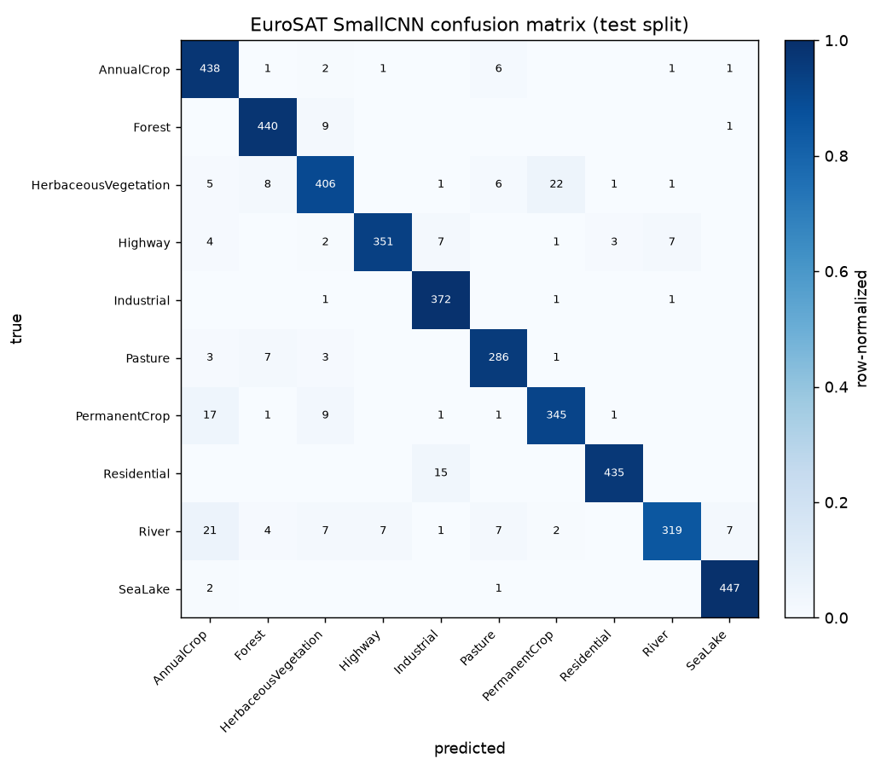

# A trained CNN on EuroSAT, and what it says about the Thau negative

## Summary

The main experiment in this repository runs Clay as a frozen encoder and trains
nothing, and it reports an honest negative: the embeddings do not detect the 2018
Thau malaïgue. This note is the companion that does train. It trains a small
convolutional network from scratch on EuroSAT, a labelled Sentinel-2 dataset in
the same sensor domain, and compares it against a frozen-feature transfer
baseline. The from-scratch network reaches 94.8 percent test accuracy. The transfer
baseline, a frozen ImageNet ResNet18 with a linear probe on top, reaches 94.4
percent, so the two are effectively tied and the trained network is marginally
ahead. That is not the textbook result, and the surprise is discussed below. The
point is not the leaderboard number. It is that the imagery is very learnable
when labels are abundant, which is exactly the condition the malaïgue experiment
did not have.

## Why this exists

The Thau experiment uses a frozen encoder because the crisis offers only about
fifteen cloud-free scenes and a handful of in-situ points, which is far too few
to train on. That is the right choice there, but it leaves a gap: it never shows
what a model learns from Sentinel-2 imagery when labels do exist. EuroSAT fills
that gap without leaving the sensor. It is 27,000 chips of 64x64 pixels from
Sentinel-2, sorted into 10 land-use classes, so a network can actually be trained
and evaluated on it.

Two models are trained, to keep the comparison honest.

- A small CNN, trained from scratch on the native 64x64 RGB chips. This is the
  trained network.
- A frozen ResNet18 backbone, pretrained on ImageNet, with a single linear layer
  trained on its extracted features. This is a transfer baseline, a linear probe.
  It is not a trained CNN and is labelled as a probe throughout.

## Data

EuroSAT RGB, 27,000 images at 64x64 in 10 classes: AnnualCrop, Forest,
HerbaceousVegetation, Highway, Industrial, Pasture, PermanentCrop, Residential,
River, SeaLake. The download is the HuggingFace mirror, about 90 MB. The split is
made once from seed 42 and is stratified by class, so each split keeps the same
class proportions and no image appears in more than one split. The sizes are
18,900 training, 4,050 validation, and 4,050 test.

## Method

The small CNN has four convolutional blocks. Each block is a 3x3 convolution,
batch normalization, a ReLU, and a 2x2 max-pool, taking the chip from 64 pixels
down to 4 across the four blocks while the channel count grows from 32 to 256.
A global average pool, dropout, and one linear layer produce the ten class
scores. The network has about 391,000 parameters. It is trained with Adam,
cross-entropy loss, a small weight decay, and light flip augmentation, for 20
epochs on CPU, at about two minutes per epoch. The best-on-validation checkpoint
is kept, which fell on epoch 19.

Normalization statistics are computed on the training split only and then applied
to all splits, so no validation or test pixel statistics leak into training. The
test split is evaluated once, at the end, by a separate step.

The transfer baseline passes every image once through the frozen ResNet18 to get
512-dimensional features, then trains only a linear layer on top. Nothing in the
backbone is updated.

## Results

| Model | Test accuracy |
| --- | --- |
| SmallCNN, from scratch | 94.8 percent |
| ResNet18 frozen, linear probe baseline | 94.4 percent |

The two models are within half a percentage point of each other, and the
from-scratch CNN is slightly ahead. This is not the outcome the comparison was
set up to expect. The usual lesson is that an ImageNet backbone beats a small
from-scratch network by a clear margin, and that did not happen here. The likely
reason is the domain and the readout. EuroSAT chips are 64 pixels of overhead
Sentinel-2 imagery, while ResNet18 was pretrained on natural photographs and
expects 224-pixel inputs, so its frozen features come from images upsampled well
beyond their native resolution and from a domain it never saw. The probe is also
only a linear layer, a deliberately weak readout that measures how far the frozen
features carry, not how well the backbone would do if it were fine-tuned. A
fine-tuned ResNet would very likely pull ahead, but that would no longer be a
frozen-feature baseline. Trained end to end at the native resolution, the small
CNN learns features matched to this data and holds its own against the
transferred ones.

Both models sit below the published state of the art on EuroSAT, which reaches
roughly 98 to 99 percent. That gap is expected and has clear causes: a small
network rather than a deep one, RGB only rather than all thirteen Sentinel-2
bands, and a CPU epoch budget rather than long GPU training. Neither model closes
it, and the honest, slightly surprising part is that the frozen probe does not
beat the trained network.

The confusion matrix shows where the from-scratch network struggles, and the
mistakes are the sensible ones. The largest off-diagonal counts are
HerbaceousVegetation read as PermanentCrop, River read as AnnualCrop, and
PermanentCrop read as AnnualCrop, with a smaller cluster of Residential read as
Industrial. River is the weakest class, at about 85 percent recall, and the crop
and vegetation classes trade errors among themselves. These are classes that are
genuinely close in colour and texture seen from above, so the confusion is a
property of an RGB view at this resolution, not a defect in the loop.

## The link back to the malaïgue negative

Clay's frozen embeddings missed the 2018 malaïgue, but not because Sentinel-2
imagery lacks learnable structure. EuroSAT shows the imagery is very learnable
when tens of thousands of labels exist. The malaïgue experiment failed for a
different reason: the crisis had about fifteen scenes, no labels, and a signature
that was largely subsurface. EuroSAT shows what a trained model extracts when
labels are abundant; the Thau experiment shows what happens when they are not.
The two results are consistent. A learned representation is only as good as the
supervision and the signal behind it, and the lagoon had neither in quantity.

## Limitations

- RGB only. EuroSAT also ships all thirteen Sentinel-2 bands, and the red-edge
  and infrared bands carry most of the vegetation signal. Adding them would lift
  the from-scratch accuracy and close more of the gap to the state of the art.
- A small network and a CPU budget. The architecture and the epoch count are
  sized for a laptop without a GPU, so this is not a maximal result and is not
  meant to be one.
- The probe is frozen and linear. It measures how far ImageNet features carry on
  this task, not how well a fine-tuned network could do.
- The split is image-level. No image appears in two splits, which is the standard
  EuroSAT protocol and matches how the published numbers are produced. It does
  not guarantee geographic separation, since EuroSAT chips are cropped from
  larger Sentinel-2 scenes, so some spatial autocorrelation between train and
  test is possible. A strict scene-level split would be a more conservative test.

## Conclusion

A small CNN trained from scratch on EuroSAT classifies Sentinel-2 land use at
94.8 percent, and a frozen ImageNet backbone with a linear probe reaches 94.4
percent. The two are effectively tied, which is itself the honest finding: on
64-pixel overhead imagery a small network trained end to end matches a frozen
ImageNet backbone read out linearly. Both confirm that the imagery carries
strong, learnable structure when labels are abundant, which is the missing half
of the Thau story, where the labels and the surface signal were not there to
learn from.
